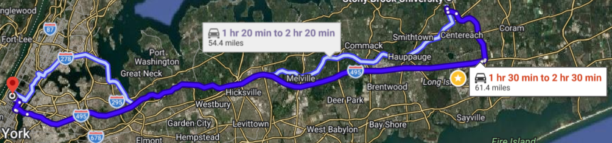
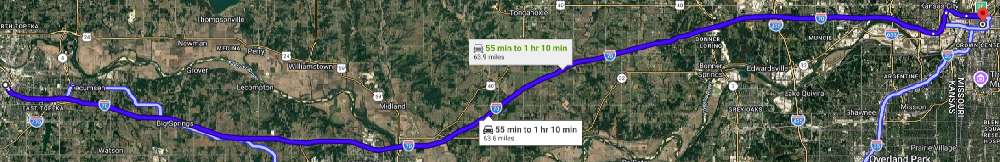
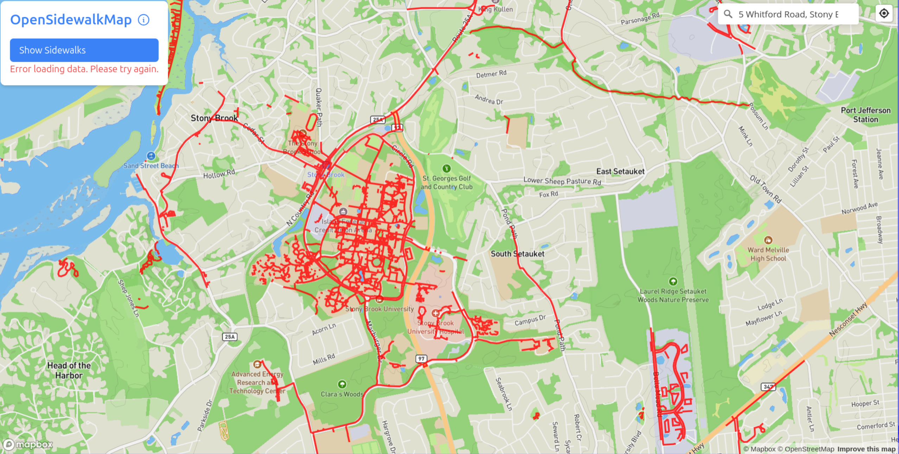
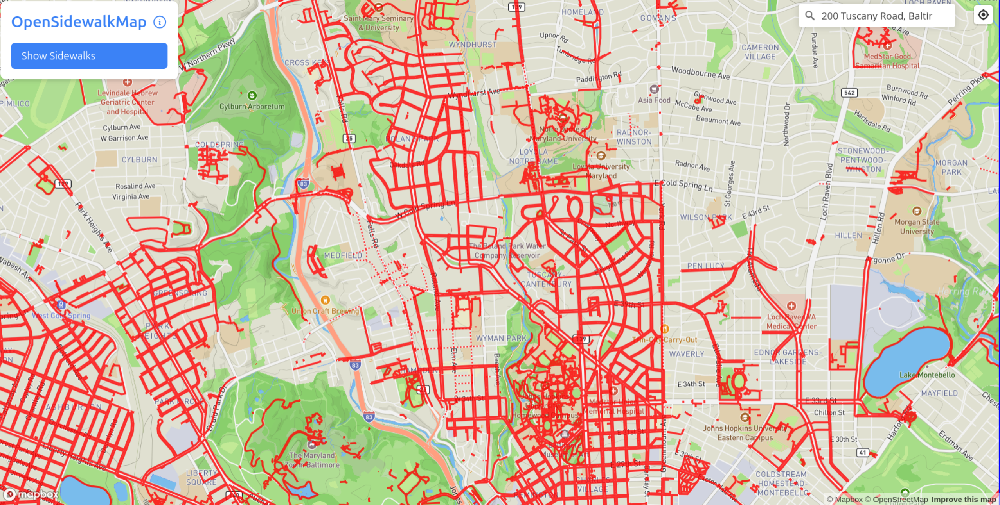
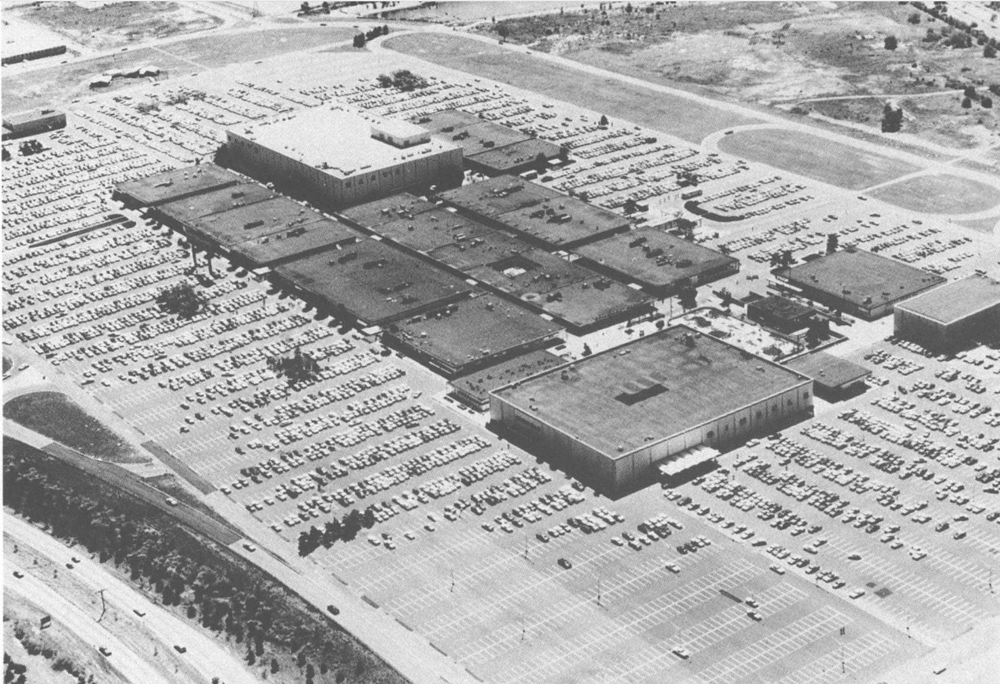
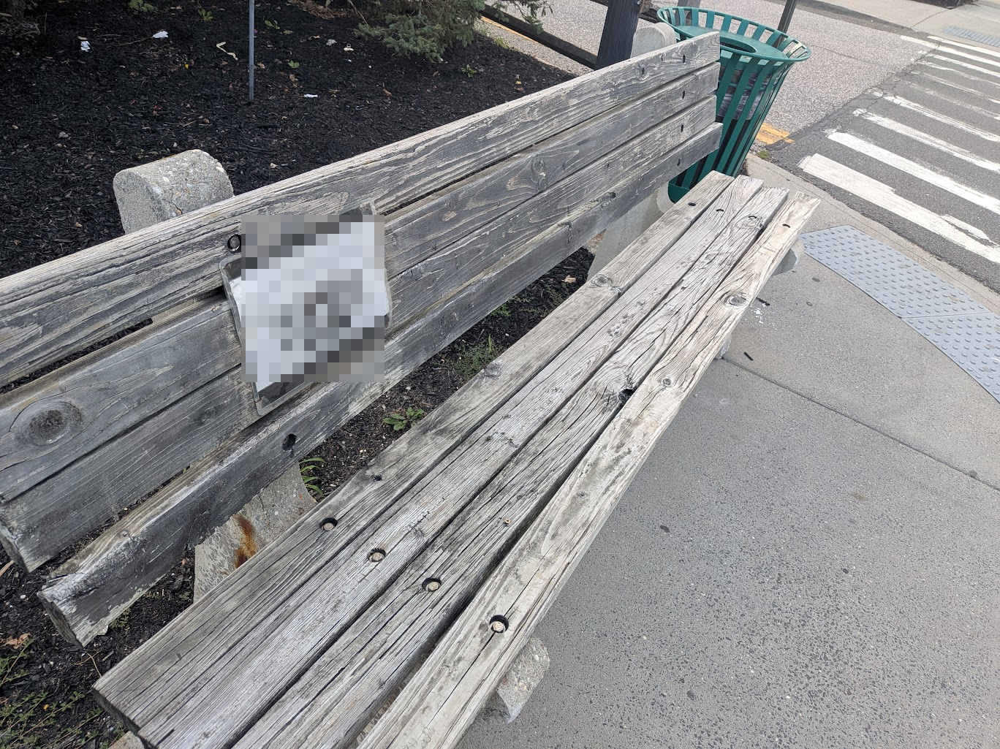

```{r, include = F}
library(ggplot2)
library(tidyverse)

```

# Stepping Outside and Into Traffic

In 2023, the New York Metropolitan Area had the [worst traffic](https://www.tomtom.com/traffic-index/ranking/?country=CA%2CMX%2CUS&population=MEGA) in the United States, and the 20th worst in the entire world. It took New York drivers an average of almost 24 minutes to travel 6 miles---about four minutes faster than the worst city in continental North America (Toronto) but about three minutes slower than Washington, D.C., and about four slower than San Francisco.

One way to demonstrate how dramatic these differences can be is to compare how long it takes to get from two pairs of equidistant places in different parts of the United States. From Stony Brook University to the middle of Manhattan, as you can see from the below screencap of Google Maps, is a little over 60 miles. If we ask Google Maps to predict our commute by saying we'll leave SBU at 8 AM on a Friday, and ask it to take the most direct highway route possible, we can see that the estimate is somewhere between 90 and 150 minutes.



By contrast, consider another part of the country that is nearly the same distance (about 64 miles): between Topeka, KS and Kansas City.[^1] As you can see below, this journey usually takes a little more than half the time. Why?

[^1]: This also follows the interstate, and departs at 8 AM on a Summer Friday.



The next time you are sitting on Nicholls Road or 347, behind a heating-oil delivery truck but before you get to a lane-narrowing, and after someone just cut you off making an unprotected left just as the light turned green the intersection before,[^2] you can ask yourself this question.

[^2]: I *hate* the Long-Island convention of turning left in front of traffic the moment a light turns green. This is illegal, and is called an "unprotected left." The [New York State Drivers Manual Section 4266 (Right of Way)](https://dmv.ny.gov/new-york-state-drivers-manual-and-practice-tests/chapter-5-intersections-and-turns#section-4266) states: "If drivers approaching from opposite directions reach an intersection at about the same time, a driver that turns left must yield to traffic that moves straight or turns right...For any left turn, the law requires you to yield to any traffic headed toward you that is close enough to be a hazard." End of rant.

There are two basic kinds of answer. On the one hand, to the question "why am I stuck in traffic?", you *could* simply answer: "because these jerks won't get off the road!" But on the other hand, you could look *beyond* the personal to ask, in turn, why do all those other ~~jerks~~ people also feel like they have to be on the road at that same time? It is possible, in other words, to expand our perspective from purely personal answers to questions of why things happen in the world to those that involve **social** causes and forces.

So, why *are* you sitting in traffic? On Long Island, there are lots of reasons!

::: column-margin
The **social** domain is any set of actions, interactions, beliefs, or material structures that draw from shared meanings or require coordinating people.
:::

First, Long Island has few, infrequent, and expensive public transit options, especially *within* the Island. Of the 15 counties [assessed](https://alltransit.cnt.org/rankings/) by the Center for Neighborhood Technology, Suffolk County has a 3.8 "overall transit score" compared to a 9.9 for New York City (on a 10-point scale.)

Beyond public transit, second, your options for non-car transportation are limited. For instance, it is dangerous to walk; Long Island also has *terrible* sidewalk coordination, as demonstrated by this [OpenSidewalkMap](https://www.opensidewalkmap.com/40.9160929/-73.1137309/13.33) visualization of the area right around campus. 

::: column-margin
To get a sense of what a stark contrast this is, compare it to a sidewalk map for an equally-suburban-ish location next to a University in Baltimore. 
:::

We can go deeper: to explain why Long Island ended up with poor public transit and heavily dependent on cars, we have to probe its social history. Long Island is composed of three large political entities (the boroughs of NYC, Brooklyn and Queens, which themselves were independent cities until they were annexed by New York City in 1898), Nassau County, and Suffolk County (which covers roughly the Eastern half of Long Island). As you can see from the figure, very few people lived in Suffolk until just after World War II, when the population exploded from about 250,000 in 1950 to about 1.25 million in 1975. As we will discuss later in the course, like the vast bulk of this population was part of the broader suburban expansion taking place throughout the United States,[^3] this wave of expansion carried with it an image of what suburban life was supposed to be like [@jacksonCrabgrassFrontierSuburbanization2006]. The image was a family living in a detached home, with a yard (and on Long Island, a pool in that yard!), and at least one car. Accordingly, to the extend that planning was done during this wave of suburban expansion, it focused on how to accommodate cars, low-density housing, and organized amenities (shopping, entertainment, and so on) for car, as opposed to public-transit access [@silvermanSuburbanLocalismLong1991].

[^3]: Indeed, the first-even [Levittown](https://en.wikipedia.org/wiki/Levittown,_New_York), which became a symbol of the suburbs, is on Long Island, albeit in Nassau County.

::: column-margin
Here is an example of suburban amenities planning on Long Island, from Roosevel Field shopping mall in 1968:  Image via @silvermanSuburbanLocalismLong1991.
:::

```{r suffolk population, echo = F}
#| fig-cap: "Source: US Census, via <a href='https://en.wikipedia.org/wiki/Suffolk_County,_New_York' style='color:blue;'>Wikipedia</a>. 2025 population is estimated."

library("tidyverse")

read.csv2("../data/suffolk_pop.csv", sep = "\t") %>%
  mutate(Population = Population / 1000) %>%
  ggplot(aes(x = Census.Year)) +
  geom_line(aes(y = Population)) +
  labs(title = "Historical Population of Suffolk County, NY",
       subtitle = "1790-2025",
       y = "Population\n(Thousands)",
       x = "Year") +
  theme_minimal()
```

Many of the great cathedrals of this kind of suburbanization and its planning---particularly, giant malls you would linger at all day---are dead or dying, but people still have to get to work. In fact, the [American Community Survey](https://data.census.gov/table/ACSST1Y2024.S0802?q=Commuting&g=050XX00US36103&y=2024&tp=false), a national, representative sample of a variety of behaviors conducted by the United States' census bureau, summarizes the situation well.

| Type of Transit  | Number  | (Rounded) Percentage |
|:----------------:|:-------:|:--------------------:|
|   Drove Alone    | 555,773 |         72%          |
|    Carpooled     | 65,253  |          8%          |
|  Public Transit  | 39,214  |          5%          |
| Worked From Home | 82,031  |         11%          |
|      Total       | 773,512 |        \~100%        |

: Type of Commutes Undertaken in Suffolk County, NY, ACS 2024

So, to summarize: why are you stuck in traffic? Because there are lots of cars. Why are there lots of cars? Because there's not much public transit. Why isn't there more public transit? Because Long Island's development was oriented around cars. What has made traffic worse over time? Population growth and single-car commutes to work.

[blazow!]{.smallcaps} You've just had your first dose of sociology!

# The Sociological Imagination

The above example about traffic, and especially the moment of moving from a purely personal understanding of the causes of a given situation to its social components, is what we call the **sociological imagination**. Partly because of the intellectual structure of the discipline, sociologists tend to restate basic concepts repeatedly and in different vocabularies, and so there have been at least two major statements describing the sociological imagination.

::: column-margin
The **sociological imagination** is the capacity to analyze phenomena in terms of the social forces that shape and constitute them.
:::

## One Phrasing: The Soul of Society

The first statement was made by W.E.B. Du Bois (1868-1963),[^4] who, in addition to being the first black man to earn a Ph.D. from Harvard, spent his notable career writing works exploring the legacies of slavery and race in the United States. He also wrote *The Souls of Black Folk*, which expressed his vision of the sociological imagination.

[^4]: .jpg)](../images/1_W.E.B._Du_Bois.jpg)

To get a sense of the point Du Bois wants to make about the sociological imagination in *The Souls of Black Folk*, think back to when you were a child. Chances are that you will remember a time when other children or adults made you feel different. Maybe you were picked first or last for something; maybe people thought you were especially funny, serious, pretty, or ugly; maybe children wanted you to play certain kinds of games and not others; maybe your parents warned you about playing with other kinds of children; maybe they expected you to start working earlier or later than others.

Depending on how good your memory is, you might also remember the reasons that other people gave for treating you like they did. The reasons could have been idiosyncratic--you're too tall or short, or people loved or hated the haircut you chose--but if you heard the same reasons over and over, and across many different people, the chances are that they represented **social categories** which formed the basis for how people perceived you.

Du Bois recognized this dynamic too, and wrote about it in *The Souls of Black Folk* [-@duboisSoulsBlackFolk2007], opening the book with his own painful childhood memory:

> I was a little thing, away up in the hills of New England...In a wee wooden schoolhouse, something put it into the boys’ and girls’ heads to buy gorgeous visiting-cards––ten cents a package––and exchange. The exchange was merry, till one girl, a tall newcomer, refused my card,––refused it peremptorily, with a glance. Then it dawned upon me with a certain suddenness that I was different from the others; or like, mayhap, in heart and life and longing, but shut out from their world by a vast veil. I had thereafter no desire to tear down that veil, to creep through; I held all beyond it in common contempt, and lived above it in a region of blue sky and great wandering shadows. [@duboisSoulsBlackFolk2007, p. 8.]

::: column-margin
A **social category** is a shared basis for grouping people together or dividing them apart. Social categories include gender, race, ethnicity, national origin, ability, appearance, and class.
:::

Du Bois lyrically elaborates on the effect of being seen through one's social categories:

> ...the Negro is a sort of seventh son, born with a veil, and gifted with second-sight in this American world,---a world which yields him no true self-consciousness, but only lets him see himself through the develation of the other world. It is a peculiar sensation, this double-consciousness, this sense of always looking at one's self through the eyes of others, of measuring one's soul by the tape of a world that looks on in amused contempt and pity. [@duboisSoulsBlackFolk2007, p. 8.]

If we generalize beyond Du Bois' specific concern with the black experience of slavery and its bitter aftermath in the united states, we can see two ideas locked in a close orbit in this passage. The first is the melancholy observation that social categories impose expectations on individuals---to the extent that you are seen *as* black or white or asian or biracial, and so on, others will expect you to speak, act, and behave in characteristic ways, and those expectations come to be a part of how you see yourself.[^5] But second, by referencing this state as the "gift" of "second-sight,"[^6] Du Bois also seems to be saying that double-consciousness also (potentially) provides a unique perspective on the world.

[^5]: Du Bois seems to desire "true self-consciousness," by which he seems to mean the freedom be anyone you want to be.

[^6]: This is the ability to perceive phemonena and events that other people cannot

These two ideas---of how one perceives oneself in terms of other's perception and the unique perspective this affords---together form a foundational aspect of the sociological imagination. And while this aspect is labeled in different ways in different sociological traditions, one of the most common today is **reflexivity.** The rest of *Souls of Black Folk* implies that Du Bois thought only certain people had reflexivity by virtue of their social positions, but it is also a capacity that we attempt to cultivate in everyone through the sociological imagination.

::: column-margin
**Reflexivity** is people's ability to see themselves simultaneously in terms of their own self-perception, but also in terms of the social categories through which others might perceive them.
:::

## Another Phrasing: The Sociological Imagination

Like Du Bois, C Wright Mills^[.](../images/1_C_Wright_Mills.jpeg)] produced a true heap of writing over his (shorter: 1916-1962) life time which, also like Du Bois, spanned public-facing work and much technical social science. But her is perhaps best-known today for a short book he published in 1959, called *The Sociological Imagination* [-@millsSociologicalImagination1959]. The whole thing is worth a read, but in the first chapter ("The Promise"), Mills outlines another view of what the sociological imagination is.

Mills begins by recognizing that, in (then-)contemporary society, people feel "trapped" in their lives.  As we writes, this is because of

> seemingly impersonal changes in the very structure of continent-wide societies. [...]^[For those who don't know, these elipses (...) mean that I'm skipping some detail in the original text I am quoting.] Neither the life of an individual nor the history of a society can be understood without understanding both.  Yet men do not usually define the troubles they endure in terms of historical change and institutional contradiction.  The well-being they enjoy, they do not usually impute to the big ups and downs of the societies in which they live. Seldom aware of the intricate connection between the patterns of their own lives and the course of world history, ordinary men^[Notice the sexist language Mills uses: he actually says "men." Until the last 30 years or so, "man" was an impersonal noun in English, used similarly to how we use the word "people" today, or, more esoertically, "one." (As in: "when one tries to understand how to use a word in a new way, one usually does so best by seeing an example of that new use.")] do not usually know what this connection means for the kinds of men they are becoming and for the kinds of history-making in whicht hey might take part. They do not possess the quality of mind essential to grasp the interplay of man and society, of bigraphy and history, of self and world. They cannot cope witht heir personal troubles in such ways as to control the structural transformations that usually lie behind them [@millsSociologicalImagination1959, p. 3-4].

There is obviously some flowery language happening in this passage---the line about "the interplay of man and society, of biography and history, of self and world" is particularly famous---but the central theme of the passage is that there are **social forces** acting on the fate of our lives.  To put it a little differently: yes, there are things that happen individually *to you* and no one else in your life.  You are born to a particular set of parents,^[Me: Modena and Gary Wilson.] you live in a given place,^[Me: Stony Brook, NY.] fall in love,^[Me: [bro, i am lowkey obsessed!]{.smallcaps}] fall back out of love,^[Me: [*Sniffles*...i'm....fine...]{.smallcaps}] grow up,^[Me: should be done in a year or two.] get educated,^[Me: Baltimore City Public School #233 to Friends School of Baltimore (Go Quakers!) to The University of Maryland, College Park (Go Terps!) to the University of California, Berkeley (Go Bears!).] and (probably) work at one kind of job or another.^[Me: a postdoctoral fellowship at Yale University (Go Bulldogs!) to a faculty position at Stony Brook (Go Seawolves!).]  Think of all the different combinations of social categories and events that you occupy, and you find that there is a pathway through them *so* unusual that we think of it as unique; you are an individual.

::: column-margin
A **social force** is any action taken by a person or group, intentional or unintentional, that brings about a state of affairs in the world, and which an individual perceives as external to themselves.
:::

And *as* an individual, the *specific* choices you make are under your control, and in modern societies we hold responsibility for those choices in a variety of ways, but the key to understanding social forces is that they create the set of choices we have in the first place. For instance, the schools I attended are partly a story of what my parents could afford; what they could afford is partly a matter of their occupations; their occupations are partly related to their own educational background and social class; their backgrounds are in turn intertwined with how social forces shaped their own lives and opportunities. Mills is calling our attention to this duality: our choices are our own, but we are presented with different choices both over time and across social and physical space.

In the rest of "The Promise," Mills unfolds our experience of this duality.  Often, he thinks, we experience the effects of social forces as **troubles**---that is, we tend to stay focused on ourselves and neglect the work of social forces. Think of getting dumped, for example. Most of us, when it first happens, experience this as intensely personal.  Even if we're told "it's not you, its me," it still *feels* like a pain that no one else has ever felt like you're feeling.  But there's another way to see getting dumped too, particularly when it (quite literally) isn't something that's happening just to you, but also to many other people who are *like* you:^[This means that they share many of the same aspects of their backgrounds, like the ones enumerated above.] the individual pain you are feeling might have a strong connection to the work of one or more social forces. When we see a problem this way, Mills thinks we should call it an **issue.**

::: column-margin
**Troubles** are the effects of social forces, limited to the perception of psychological effects like happiness, joy, sadness, and anxiety. 

**Issues** are the effects of social forces, when considered at the level of social categories and groups of people.
:::

To continue playing with the example of getting dumped: why should that be painful in the first place?  Well, Mills thinks that this is partly because of another effect of social categories and society. Just by virtue of living in society, over time we are exposed to, and sometimes come to incorporate **cherished values** with varying levels of awareness.  Cherished values can be seen as commitments people hold about what outcome "should" result from a given set of behaviors.  So, breakups feel painful partly because we^[As we will see later in the course, "we" do not *universally* cherish most things in modern society.  More technically, a value is socially cherished if you are at least aware of "how it should be" and what expectations are in a given situation, whether or not you feel personally committed or motivated by them.] cherish the value of being in romantic love: as a society, we uphold and venerate the idea that to be "in a relationship" is a matter of making a "soul-mate" connection with someone else, and getting dumped can make you feel like you were mistaken about what was going on.  For some of us and concerning some values, we may be able to easily articulate and verbalize what the value is that we cherish in a given situation; for other people and values, sometimes we may only be able to vaguely sense that something is important without being able to put words to it.

::: column-margin
**Cherished values** are deeply-held, meaningful desires, goals, or states of affairs about which people may or may not be aware, and which, depending on circumstance, they may or may not perceive to be under threat.
:::

Mills invites us to see that, as social forces reshape society, they can put different cherished values under threat while reinforcing and even creating others.  Depending on our ability to actually articulate what those cherished values are, we can thus be in one of four different states:

||Cherished Values Not Threatened| Cherished Values Threatened|
|:--:|:--:|:--:|
|**Can Articulate Values**|Well-Being|Crisis|
|**Cannot Articulate Values**|Indifference|Uneasiness|
: C. Write Mills' Typology of Cherished Values in Changing Times

Think of your own emotions right now.  How do you feel?  Can you say what really matters to you, and whether you think you can hold on to it or achieve it?  The power of the sociological imagination is that it lets you understand yourself, your hopes and dreams, as well as the possibility of realizing them, in terms both of your own live, but also in the context of social forces and social change.

# Sociological Imaginations

To make sure we have a grip on the sociological imagination, let's close with a couple more examples, which I will explore more briefly than the traffic-jam example above.

## Climate Change

<https://www.newsday.com/nextli/data/map-long-islands-stormy-future-cyh0ndzv>

https://ourworldindata.org/grapher/annual-co2-emissions-per-country?time=1850..latest&country=\~OWID_WRL

https://nysclimateimpacts.org/explore-the-assessment/new-york-states-changing-climate/nysc-precipitation/

https://ourworldindata.org/data-insights/japans-cherry-trees-have-been-blossoming-earlier-due-to-warmer-spring-temperatures

## Opioid Addiction

If you travel to a nearby town, near the center of that town you'll see a bench.  For several years, it had a sports helmet chained to it, but now only has a laminated piece of paper on it, remembering a star athlete who died in his early adulthood.^[I am deliberately keeping the specifics vague, since the family never officially announced the cause of the man's death.]



Unfortunately, this man was rumored to have died by ingesting what he thought was an opioid like Percocet or Vicodin, but which had been laced with a much more powerful synthetic opioid, fentanyl.  Indeed, many people of a certain age have friends or family members who have struggled with opioid addiction, even if they survived. And as anyone who has experienced opioid addiction or been close to someone who has will tell you, it is an engine of troubles, destroying people's health, costing themselves and their loved ones dearly, and wrecking relationships.

And yet opioid addiction is not *just* a result of personal troubles; it is also an issue resulting from the interplay of social forces. Opium (the source of the class of drugs called opium, and a refinement of the flow and seeds of the poppy plant) has been used for hundreds of years to treat pain and a variety of other ailments, and two of its most active ingredients, [morphine](https://en.wikipedia.org/wiki/Morphine) and [codeine](https://en.wikipedia.org/wiki/Codeine), were isolated in the 19th century. In the 20th century, chemists also synthesized and refined new, more potent drugs in the same class, including [oxycodone in 1916](https://en.wikipedia.org/wiki/Oxycodone), [hydrocodone in 1920](https://en.wikipedia.org/wiki/Hydrocodone), [hydromorphone in 1921](https://en.wikipedia.org/wiki/Hydromorphone), and [fentanyl in 1959](https://en.wikipedia.org/wiki/Fentanyl#History). 

https://oasas.ny.gov/overdose-death-dashboard#:\~:text=NYS%20Overdose%20Death%20Dashboard

<https://www.kff.org/mental-health/alcohol-deaths-national-trends-and-variation-by-demographics-and-states/>

Art Van Zee (in Zotero) on Oxycontin.
