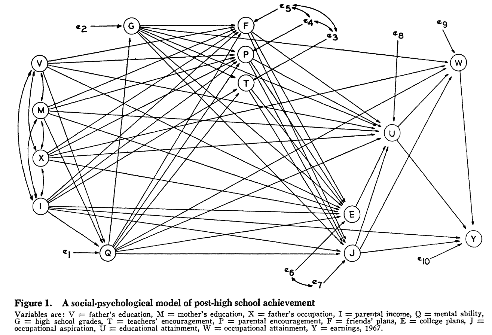
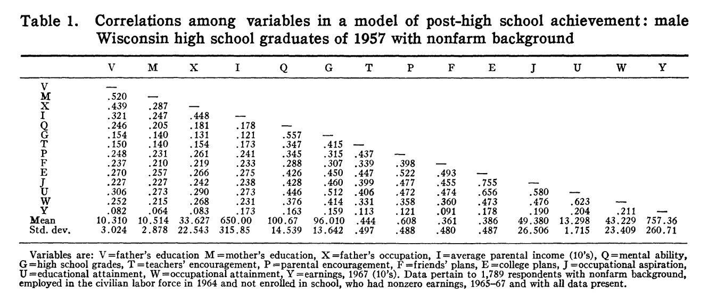
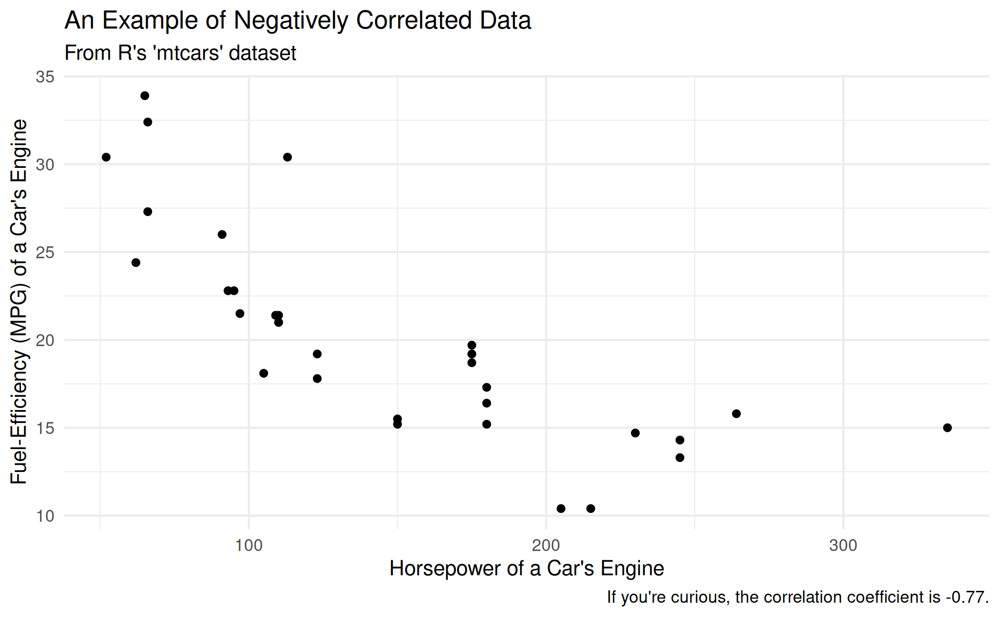

# Introduction

In contemporary sociology, given the multitude of different epistemological viewpoints the discipline employs and ontological levels it addresses, scholars come from many different theoretical traditions and use several different methods. A full survey of these approaches is beyond the scope of any introduction to the field, so here I simply recount major families of theory that are still in use today, as well as different popular methods (with examples!)

One last caveat about the nature of "methods" bears repeating. Contemporary critics of science tend to argue for a strict, even strident, division among key components of the **research process**: forbidding one's personal commitments from influencing the selection of a research topic; demanding a strict separation of research design from data collection; and emphasizing that the *only* means to accrue "true" knowledge is via extremely stringent research designs (which are often impossible to construct except for certain topics). By contrast, along with the pluralist approach I emphasized in the [last unit](../chapters/Ch_2_Discipline.qmd), here too I stress the mixture of these different steps of the research process together. Put differently, it is rare indeed for a working scientist (social or otherwise) to obey a strict separation among the formulation of a question, designing a study, conducting it, analyzing data, and drawing conclusion. Instead, they are mixed together.

::: column-margin
The **research process** is a mixture of practices undertaken by scientists to learn about the social and material world. It includes formulating a question that can be answered empirically; designing a procedure to systematically answer the question with appropriate evidence; understanding what other scientists have argued about the question; and analyzing the data collected. These steps are usually treated as distinct, but in practice they are deeply intertwined with one another.
:::

# Key Theories in Contemporary Sociology

There are several noteworthy theoretical traditions in sociology today, and broadly, I group them into three pairs: two micro-sociological traditions, two macro-sociological traditions, and two "exotic newcomers," by which I mean traditions which purport to resolve tensions in the older traditions, and which are the subject of intense discussion today.

## Micro-Oriented Theoretical Traditions

I group these theories under the heading of "micro-oriented" because, as discussed in the [last unit](../chapters/Ch_2_Discipline.qmd), sociology generally focuses on two ontological levels. Accordingly, "micro-" theories tend to be based in, and focus their theorizing on, the plane of face-to-face interaction among people, and their direct interactions with the material world.

### Symbolic Interactionism

The older of these two traditions is called "symbolic interactionism," and was pioneered by Herbert Blumer [-@blumerSymbolicInteractionismPerspective1986], who himself was a student of a classical sociological theorist at the University of Chicago named George Herbert Mead. This tradition draws from "pragmatism," a philosophical tradition which asks how people in the world encounter, formulate, and overcome problems in their concrete actions.

As an example of the pragmatist perspective, consider a recent (excellent) piece of science fiction that has been made into [a movie](https://en.wikipedia.org/wiki/Project_Hail_Mary_(film)): [*Project Hail Mary*](https://en.wikipedia.org/wiki/Project_Hail_Mary)*.* The story follows a human astronaut who is tasked with saving the planet Earth by traveling to a nearby star. While doing so, he encounters an alien on a parallel mission, who has radically different biology and no ability to make speech-like sounds. However, the two learn to communicate, solve engineering challenges together, and (SPIOLERS!) save both of their home planets.

That these two beings from radically different biologies, cultures, and backgrounds learn to communicate illustrates a pragmatist perspective well. They do not worry about the ontology or epistemology of language before communicating; they are simply trying to solve problems (how to communicate, then how to save themselves and others) and communication is necessary for them to coordinate. Moreover, they don't ask themselves what the *optimal* or *purest* form of communication is; instead, they go with "whatever works."[^1]

[^1]: [They begin](https://www.youtube.com/watch?v=-mwLAjsdgVM&t=107s) with shared behavior, then counting to establish a shared number system, and go from there.

This pragmatist heritage demonstrates the central concepts of symbolic interactionism. In situations where people need to coordinate action---that is, in which they need to do something together, even if that "something" is to cohabit without conflict---they do this by **interacting**. And they do this by exchanging shared **symbols.** A symbol is simply a representation of another thing, encompassing everything from direct indexes,[^2] to iconic representations,[^3] to highly abstract conceptual representations[^4]

[^2]: In which I point at flames and yell "fire," and you understand that the word "fire" represents those flames.

[^3]: In which I draw a little stick figure on the board, and you understand that it represents a person, since it has a head, limbs, and so on.

[^4]: In which I declare that, in the equation $$Y = \beta_0 + \beta_1X_1 + \epsilon$$ $\epsilon$ stands for the error in coefficient estimation.

As you can imagine by these examples of the exchange of symbols, symbolic interaction *heavily* privileges micro-interactions. As shown by another famous symbolic interactionist, Erving Goffman [-@goffmanFrameAnalysisEssay1974], these interactions can become highly elaborate, including everything from simple interactions based on eye contact all the way to elaborate ruses in which some people are "keyed into" the nature of the con, while others are unwitting "marks." However, these interactions, for symbolic interactionists, are irredicible to the intentions of any one person involved in them; instead, they are governed by emergent **frames** which define what the interaction is "about." As we will discuss more in [unit 5](../chapters/Ch_5_Interaction.qmd), symbolic interactionists see modern social life as made up of the intersection of innumerable frames for understanding situations, but for now, it will suffice to note that they think that *every* social interaction must have at least one frame.

::: column-margin
**Interactions** are exchanges of shared meanings. **Symbols** are representations of one thing by means of another, including words, pictures, gestures, and material structures. **Frames** are shared meanings that define the nature of a particular set of interactions.
:::

### Practice Theory

One drawback of symbolic interactionism, even when taken as a limited micro-theory of social action, is that it depends (at least implicitly) on relatively explicit and discursively elaborated symbolic meanings.[^5] However, much evidence from socialization and action in the world suggests that this is not true, and that instead, people depend on stocks of "tacit knowledge" that they can't necessarily articulate, but which form the foundation of social action [@collinsTacitExplicitKnowledge2010; @polanyiPersonalKnowledgePostCritical1962].

[^5]: This is a fancy way of saying "all components of the interaction and what is being exchanged can be epressed in symbols."

To address this shortcoming, a school of micro-analysis has grown up around the study of "practice," and is usually now identified with the work of Pierre Bourdieu [@bourdieuOutlineTheoryPractice1977; @bourdieuInvitationReflexiveSociology1992]. The central idea of practice theory is that it is inadequate to only study the symbols expressed by people in interactions, one must also observe what they *do* in the material world [@lizardoImprovingCulturalAnalysis2017]. Thus, for instance, one might *say* during an interview that they are committed to abstaining from drug use, but if you *observe* them and their environment, you might find evidence that belies this declaration [@jerolmackTalkCheapEthnography2014].

Notably, the assertion of practice theory is *not* that these implicit orientations to the world, expressed in practices, are not socialized; rather, it is the realist argument that there are socialized dispositions towards the world that are expressed, and can only be observed, in nondiscursive ways.

## Macro-Oriented Theoretical Traditions

As I have emphasized already, social life contains at least two levels of analysis. Consequently for our purposes here, another pair of theories have emerged to address macro-phenomena, and like micro-oriented theories, they two are partially responsive to one another.

### Structural/Functionalism

A first macro-theory grew up to explain how society "holds together" given its modern complexity. This tradition is usually identified with Emile Durkheim, who wrote a famous book arguing that modern societies were held together by their economic "division of labor" which made people interdependent on one another [@durkheimDivisionLaborSociety1997]. To understand how and why a person doing a certain job was able to survive without doing *everything* for their own subsistence, as well as how the social fabric as a whole stayed woven together, for theorists like Durkheim, you had to consider the form taken by the overall social *structure* as well as the *function* of any given phenomenon for the overall "health" of that structure. Accordingly, this tradition is usually called "structural functionalism."

When taken up in the middle of the Twentieth Century as the dominant theoretical approach in American sociology, structural functionalist explanations became highly elaborate. Talcott Parsons, for instance, elaborated a description of society (which he claimed to be basically complete) which accounted for all major contemporary social phenomena---the family, schooling, war, economic behavior, religion, and so on---according to how they "integrated" people into social structures and contributed to the overall continuity of society [@parsonsSocialSystem1951].

Crucially, these functions relative to the overall functioning of society need not be known to the people undertaking them; instead, Robert Merton distinguished between **manifest** and **latent** functions [@mertonSocialTheorySocial1968]. A manifest function *is* the function known to a group---a sports team, for instance, wants to win a game or have a successful season, and therefore undertakes intensive practices together to do so. But these practices also have a latent function, which the players and coaches may only be aware of in retrospect, if at all---the practices together bond the team and embed them in social relations that may endure well beyond the season or their participation in the sport, and which socialize them into disciplined work and coordinated social action.

::: column-margin
A **manifest** function of an activity is one that participants are aware of. A **latent** function of an acitivity is one that participants are not aware of.
:::

### Conflict Theory/Marxism

As is evident from the above discussion, structural functionalism, heavily emphasized the overall continuity and stability of society, as well as the role every individual plays in sustaining that order.[^6] In light of these oversights, and the manifest social conflict that emerged globally in the 20th century, another macro-tradition found traction in sociology. Whereas structural functionalism (and, to a lesser extent, symbolic interactionism as well) emphasized the overall nature of social structures being driven by *consensus* around shared meanings and the overall health of society, this tradition emphasized that societies are characterized by ongoing *conflict* among different groups within them.

[^6]: Structural functionalism *did* claim to account for activities that didn't contribute to overall social order, labeling them "dysfunctional." However, they were criticized for failing to provide a satisfying account of what made activity dysfunctional, and when such activities could be expected to appear.

Conflict theories are usually traced to the writings of Karl Marx [@tuckerMarxEngelsReader1989], thought this heritage only became explicit after anti-communist fervor in the United States faded by the 1970s [@burawoySociologicalMarxismComplementary2003]. Rather than a particular activity contributing to the overall health of society, instead it reflected the pursuit of interests of one group within society, often in conflict with the interests of other groups. Most famously, Marx theorized that this was the central dynamic of capitalism: owners of the means of production, called capitalists, sought to maximize their profits at the expense of workers, called the proletariat. Over time (debatably, as it happens), Marx thought that this conflict would worsen social inequalities, but it temporarily held society together in a kind of stalemate to the extent that the most powerful group in society could simply impose its will on others---or persuade them that their real interests were not in fact "really" what was best for them [@laclauHegemonySocialistStrategy1985].

Marx's theory, which is by far the most famous conflict theory, remains heavily economic, by other conflict theories, as well as contemporary Marxist theorizing, both relax the *direct* connection between economic organization and social conflict. C. Wright Mills, for instance, theorized that the "Power Elite" spanned all relevant social institutions, not just economic ones [@millsPowerElite2000], and neo-Marxist theorists now emphasize how domination of society by one group and its interests is a complex political, cultural, and economic process [@jagerHyperpoliticsExtremePoliticization2026].

## Exotic Newcomer Theoretical Traditions

I label these "exotic newcomer" traditions not because they are temporally new, but rather for two reasons.

1.  They both purport to address central oversights of the previous four major traditions and claim to be doing so in new ways, and
2.  While they both have long intellectual histories, it is only relatively recently that they have achieved widespread recognition within sociology's disciplinary mainstream.

### Field Theory

The first newcomer is "field theory." Derived in part from the work of Pierre Bourdieu above, field theory argues for, rather than a micro- or macro-perspective, a "meso-" or middle-range view of social structure. The central concept is the **field**, which is a social space in which actors (people, organizations, or even states) orient themselves towards one another and, together, struggle over the meaning of their shared action [@martinWhatFieldTheory2003a]. Moreover, fields are populated by "incumbents"---who have been in the field for a long time and usually have accrued a dominant position within it---and "newcomers"---who have entered the field recently and are struggling for recognition and power within it [@fligsteinTheoryFields2012].

Let's say you want to become an influencer. Unlike symbolic interactionism, you're not *directly* interacting with all other influencers, but rather, to the extent you learn about being one, you're aware of the different kinds of influencers, how they do it, and you have ideas about the audiences they reach by doing so. In other words, you're a member of the *field* of influencers, and to the extent you do it and are successful, you might even become a model for others. And if the field itself is changing rapidly, you might creatively (based on your knowledge, history, and the substance of what you're trying to be an influencer about) form a new kind of practice that gets recognized as being "an influencer."[^7] In this case, the shared frame for understanding your action is *not* face-to-face or micro-scale (as in symbolic interaction) *nor* are the actions of groups within it directly tied to their interests in society as a whole or society's overall functioning (as in macro-perspectives).

[^7]: This may be hard to believe, but there was a time when there was no such thing as "health influencers" or "fashion influencers." These ways of being an influencer had to be invented.

### Black, Feminist and Intersectional Theory

Last, but far from least, among our theoretical traditions is the black, feminist, and intersectional tradition. These are grouped together because they share a common insight, often said to be built from DuBois' work on reflexivity and double-consciousness. It begins from the emphatic rejection of the "[view from nowhere](../chapters/Ch_2_Discipline.qmd)" that is sometimes taken to be core of the scientific approach. Instead, from either the foundations of racial experience, or that of women [@hardingDiscoveringRealityFeminist2003], these approaches criticize the supposedly "universal" view of phenomena purportedly offered by mainstream sociology.

This style of theorizing makes three basic interventions in sociology:

1.  It argues that to do good sociology, you need as diverse a group of sociologists as you can find. This is because more diversity in viewpoints fosters motivation to study perhaps-overlooked phenomena [@kellertScientificPluralism2006].
2.  It also argues that, at the level of policy interventions into society (whether by governments or by social movements advocating for change), groups must be considered along the intersection of *all* salient social categories, and not just those supposedly in common to them [@collinsBlackFeministThought2002]. (In other words, for instance, black women may have substantially different interests than white women, and a coalition advocating for both groups cannot simply assume that white women's concerns are the same as *all* women's concerns.)
3.  It also argues that the direct experience of individual people, and particularly *marginalized* people, is a crucial form of sociological evidence.

# Some Sociological Methods

There are a variety of methods employed in sociology, each of which has a different relationship to our direct sensory experience. (Put differently, in the language of [unit 2](../chapters/Ch_2_Discipline.qmd), each expresses a different variety of realism and departs from naive empiricism.)

## Ethnography

The first method I will discuss is ethnography, which is oriented fundamentally around observing social phenomena as they take place, as closely as it is feasible for the scholar to do. This may include observation of social interactions or direct participation in them, and may mean conducting formal interviews with people or undertaking the same practices they do to get a sense of how their social locations shape their outlooks and behaviors.

One excellent recent example of ethnography comes from Stony Brook's own department, in the work of Alex Diamond [@diamondGoverningExcluded2026]. In his research of the demilitarizing peace process in war-torn Colombia, Alex lived in a small rural village and interviewed farmers and state officials as the Colombian government tried to wean the farmers from growing coca (the key raw component of cocaine).

### Ethnographic Analysis: Reflexivity

A key challenge in ethnographic research is maintaining reflexivity; after all, if the goal of the researcher is to directly embed themselves in an ongoing phemonenon, it can be difficult to tell (1) if what they are observing is particular to a given instance of that phenomenon or characertistic of it as a whole; and (2) whether certain aspects of what the ethnographer is observing are a product of their involvement and the presence of the social categories they represent.

## Experiments

Next, sociologists rarely, but increasingly, conduct experiments. The fundamental logic of an experiment rests on intervening in the world and then observing the difference in outcomes with and without your intervention. More elaborate experimental designs try to narrow the scope of interventions to just a single mechanism in the world, often by strictly controlling every possible factor in the setting of the experiment.

One of the most famous examples of a sociological experiment was conducted by Devah Pager [@pagerMarkCriminalRecord2003]. In this "experimental audit," she sought to understand the social costs of having a criminal record. Accordingly, she took college-student volunteers, and asked them to apply for entry-level jobs. (The measure used was whether they were even called for an interview; the experiment did no go farther for many reasons.) She divided the volunteers into white and black applicants, and then created identical resumes for applicants, save for one difference: whether they had a non-violent petty drug arrest on their record. Famously, those with an arrest record received fewer call-backs than those without (as one might expect), but also, black men *without* an arrest record were less likely to receive a callback than white men *with* an arrest record. (This is an especially powerful finding because, remember, all other aspects of their resumes were functionally identical; *only* their race and arrest records differed.)

### Experimental Analysis: Ecological Validity

One challenge for experimental studies is that it is rarely "neutral" to analytically reduce a phenomenon to a single mechanism. For instance, in famous and controversial studies of students' "grit" [@duckworth2007grit], however carefully psychologists may try to isolate a student's "passion" and "perseverance" from other social and psychological factors, the very experimental setups (involving carefully monitoring students over long periods to judge their long-term outcomes) are themselves forms of intervention that tend to privilege certain kinds of students over others to even participate in the study in the first place. This problem of a experiment's findings being "valid" (which is to say, actually a measurement of what you think you are measuring) within an experiment but being far more questionable in complex social reality is usually called the problem of "ecological validity."

## Quantitative Modeling

Another class of methods in sociology depend on the quantification of social phenomena, and then the subjection of that quantified data to modeling. By "modeling," I simply mean a formal mathematical statement about the relationship between two measurements in the world. (Thus this includes all statistical techniques, whether they are relatively simple ones that you will learn in undergraduate methods like regression, testing the difference in means for two populations, or highly elaborate forms of non-parametric regression, Bayesian parameter estimation, or random-forest regression.) In other words, the key ideas of quantitative modeling are that the world can be observed and then represented numerically, and that those numerical representations either "hang together" if the pheneomena they represent are related to one another, or do no express a relationship, if the phenomena are unrelated.

As you can see from a classic sociological study, which was based on a set of surveys of young people in the American midwest over the course of their lives from high school until well into their careers [@sewell1972causes], it is possible to represent the (hypothesized) relationship among different variables through elaborate diagrams.

And, further, the power of quantitative modeling comes into its full force when we can see that *each* of these hypothesized mathematical relationships among different social factors can, in turn, be directly estimated using the survey data underlying the study.

### Key Statistical Terms

While we are "here" in the land of quantiative modeling, let me briefly discuss a few key statistical terms that, whether or not you go on to study statistics further, will be of use in your everyday public literacy and numeracy.

First, there is a group of **measures of central tendency** which are typically confused with one another: mean, mode, and median. The **mean** is usually the simple average of a group of numbers: you sum them up, then divide by the number of observations. The **mode**, meanwhile, is the most freqently occuring observation. The **median**, finally, is the "middle" observations of a group of observations ordered from lowest to highest.

Additionally, there is a **measure of dispersion** that is commonly referred to in quantitative discussions: the standard deviation of the data. The computation of this number is beyond the scope of this course (but [not *that* complicated](https://en.wikipedia.org/wiki/Standard_deviation)), but it essentially refers to how "spread out" the data is around its mean. The *higher* the standard deviation, the more spread out the data is, and the *lower* the standard deviation, the more concentrated it is around the mean.

Finally, you'll notice that in Sewell and Hauser table 1, each of the relationships among the variable is represented by a number. The is is the **correlation coefficient** of the two variables. Again, for our (simplistic) purposes, this is a single number that describes how reliably you can know the state of one variable if you know the state of the other. Correlations run from -1 to 1, where, if the coefficient is -1, the variables are said to be "negatively correlated," and an increase in one variable will lead to a (mathematically perfect) decrease in the other. If it is 1, but contrast, the variables are perfectly "positively correlated," and increasing one will increase the other. In between those two numbers, the relationship between the two variables is imperfect, but knowing the state of one variable tells you *something* about the state of the other.

As a coda, it is well worth remembering: read all of the information provided to you in a table or figure! It often tells you a great deal (almost as much as reading the text) about the information being presented to you!

### Quantitative Analysis: Sampling Bias and Embedded Data

Among sociology's methods, quantitative modeling has the (in my view, unearned) reputation for being the most technically precise and difficult to master. However, like any other method, it confronts key challenges. The first is that it fundamentally cannot observe actual causation; instead, it is limited to (more or less sophisticated) *inference of* causal mechanisms given observed correlations. Thus, quantitative modeling is cursed to pursue something it can never achieve.

Second, the correlations that we *can* observe are only as informative as the data collected in the first place. This is true no matter what statistical wizardry is brought to bear---there is *no* foolproof way to "make up for" poorly-conducted surveys or a badly-formulated operationalization[^8] of a variable.

[^8]: In this context, "operationalization" is just a fancy word for "taking a concept and then deciding how to concretely measure it." For instance, in the figure above, we want to know how "fuel-efficient" a car is, but have a variety of different ways we could assess that. We chose miles-per-gallon, and thus "operationalized" the concept of fuel-efficiency.

## Historical and Comparative Sociology

Last, and best, sociologists also use historical and comparative methods! This family of methods uses information form the human past (whether published records, archival materials, oral histories, or even the writings of historians themselves) as the source of data for their investigations. These data can span all of recorded human history, and often emphasize *comparing* at least two different phenomena to explain why their outcomes were different or similar to one another.[^9]

[^9]: If you want to know more, I wrote a book with a colleague about this! See @mayrlComparisonPositivism2024.

A *wonderful* recent example of historical and comparative sociology was published by Anna Skarpelis [-@skarpelisHorrorVacuiRacial2023], who investigated the way that the Nazi regime thought about race. Using careful archival work to examine the Nazi's "photo books," Skarpelis finds that the Nazi's agonized over the fact that many members of the "master race" did not resemble the fair-haired, handsome and pretty imagery often seen in Nazi propaganda. The photo books at the heart of Skarpelis' study sought to "demonstrate" how what people thought was a too-big nose or dark hair was "really" a representation of another form of Aryan heritage, thus resolving a key contradiction in the racial regime the Nazi's were trying to construct.

### Historical Analysis: Archival Silences

Like quantitative modeling, the key challenges for historical and comparative sociology as a method revolve around its access to data. On the one hand, historical sociologists are limited to what archival materials actually exist in the archival record, which, unfortunately, often does not record marginalized communities directly [@trouillotSilencingPowerProduction1995; @stoler2009a]. On the other hand, and this is something that is less discussed in the method, historical sociologists can also sometimes have *too much* data. The amount of historical work produced about the Holocaust, for example, or the Russian Revolution, is nearly infinite, and you could spend your whole life just reading about either [@abbottDemographyScholarlyReading2016]. Accordingly, historical sociologists must almost always make decisions not only about where to *start* their data collection, but also, eventually, where to *stop* it.
