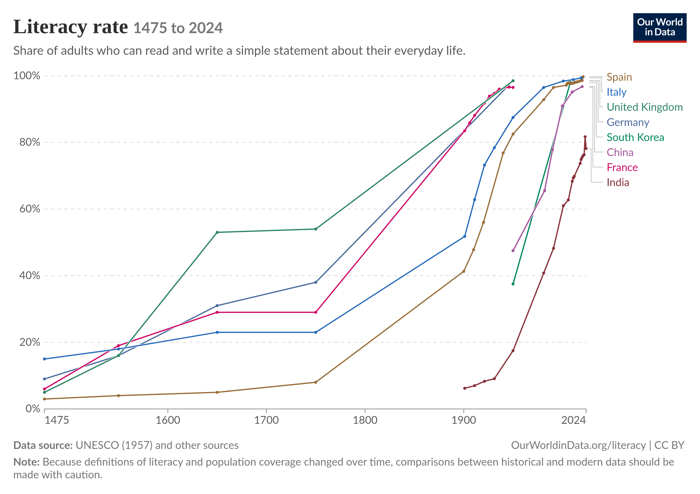
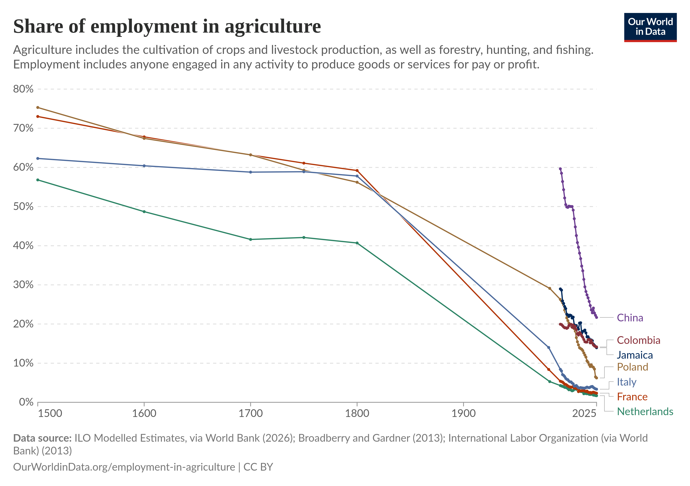

# What is "Meaning" and why is it so important to Sociology?

Look at this illustration.[^1] What do you see?

[^1]: This illusion is the famous "rabbit and duck" illustration, originally [from](https://en.wikipedia.org/wiki/Rabbit%E2%80%93duck_illusion) an 1884 German Newspaper, which is commonly used to demonstrate the "gestalt shift" in psychology by which the illustration's appearance suddenly shifts from "being" a rabbit to "being" a duck.

Some people see a rabbit. Some see a duck. Some see something in between. But what matters for us here is not exactly *what* you saw, but *that* you saw something in the first place. Someone, inspired perhaps by a rabbit or a duck, made an illustration with a pen and their hand, then that was scanned digitally and it now *is* only an arrangment of pixels on your screen. But your brain was able to take that arrangement of pixels and integrate it into a symbol representing something else, namely, a rabbit (or duck, or something in between). Sociologists (and other social scientists and humanities scholars) summarize this action of your brain to integrate stimuli into references to something else out ability to perceive **meaning** or **significance** in the world.

Sociologists care so much about meaning for a few reasons, but the most central relates to social constructions. Recall that social constructions are just real phemonena in the world which exist by virtue of our shared acceptance that the exist. That word *shared* is the key: for *how can it be* that we manage to arrive at the same, or even just similar, collective (or at least intersubjective) understandings of what is happening? A theory of meaning provides the answer–it is the ability to arrive at a shared understanding of what a thing, social setting, or phenomenon is "about," at least enough so to enable communication.

As we discussed in the [last unit](../chapters/Ch_3_Method.qmd), when discussing Symbolic Interactionism, the meanings we find in symbols have a general structure: that of a **symbol**. A symbol is composed of two parts: the **signifier**, which is the thing that is doing the representing, and the **signified**, which is the meaning or significance being represented. Sometimes, the relationship between signifier and signfied is **iconic**, which is to say, one of direct resemblance. This is most famous in some languages, like [ancient Egyptian hieroglyphics](https://en.wikipedia.org/wiki/Egyptian_hieroglyphs). But there are also times where meaning is highly dependent on its contextual appearance among other symbols. Most modern languages follow this more complex pattern.  And today, we live in a world of symbols where many, even most, do not refer to something that can be materially represented: we instead represent "love" with a heart, and use images like "stock tickers" or physical components of collective social phenomena like "markets."

Sociologists tend to study these complex objects, symbols, and their meaning at two levels of analysis, the micro and macro.

### Micro-Analysis of Culture

At the micro level, going back to the beginning of the sociological tradition (this time to a sociologist named Max Weber, who also theorized "rationalization"), sociologists have seen a tight coupling of meaning and action together. Indeed, Weber saw them as identical: for a person to "act" (which is to say, do something), was for him to

> \[attach\] subjective meaning to his behavior---be it overt or covert, omission or acquiesence. Action is 'social' insofar as its subjective meaning takes account of the behavior of others and is thereby oriented in its course...in no case does \[meaning\] refer to an objectively 'correct' meaning or one which is 'true' in some metaphysical sense [@weberEconomySociety1978, p. 4].

Here we see that "meaning" is subjective, in the sense that it is a significance attached to the perspective of particular people, but so too is it oriented towards the meanings that people infer in others.

At this micro-level, meaning operates as a form of motivating and justifying action [@vaiseyMotivationJustificationDualProcess2009].  That is, meanings can supply the *goals* you are pursuing, or they can provide the *reasons* for what you are doing.

### Macro-Analysis of Culture

Meanings also have a macro-analytic dimension, which can be well-exemplified by the classsical sociological theorist Emile Durkheim:

> Concepts...are always common to t aplurality of men.  They are constituted by means of words, and neither the vocabulary nor the grammar of a language is the work or product of one particular person.  They are rather the result of a collective elaboration, and they express the anonymous collectivty that employs them.  The ideas of *man* or *animal* are not persona and are not restricted to me; I share them to a large degree, with all the men who belong to the same social group that I do [@durkheimEmileDurkheimMorality1973, p. 151-152].

Here, meaning is at least intersubjective, and even approaches "objectivity," insofar as it transcends any given perspective of a member of society.  But the passage also suggests that meanings are interrelated on a social level: that, for instance, grammar structures the meaning that we take from words.^[Consider, for instance, that in the sentences "I have a cold," and "I am cold," the word "cold" has two different meanings only by virtue of its relationship to the other words in the sentence, not to a demonstration of a different siginified in each case.]  And for Durkheim, these interrelated meanings, in complex societies especially, work downwards on individual people; that is, they represent an emergent plane of cultural dynamics.

## Dimensions of "Culture" and Meaning

The system of symbols and their meanings is what sociologists usually call **culture**, and it has several dimensions.  The first is **values**, which as we noted in [Unit 1](../chapters/Ch_1_Imagination.qmd), amount to statements of what is good, bad, valuable, or ultimately important for people.  But culture and meaning is also often expressed in **norms,** which are rule-like statements about what is appropriate or inappropriate in a given setting.^[Usually, a norm and value can be differentiated conceptually because a norm can be stated like a rule relative to a given situation, when a value cannot.  So in the statement "You should not talk in the library, because it is good to be polite," the first clause in the sentence is a norm (specifying what you should not not and where you should not do it), and the second is the value from which the norm is derived (implying that it is generally good to be polite, regardless of where you are).]  Finally, culture and meaning are organized at the level of **material culture** which encompasses all organized, purposeful intervention by humans into the physical world, including all technology, building, and material symbolic representation.

## Meaning as unifying

As might be obvious, in some ways, culture and meaning are intensely unifying, since they are the vector through which social order is possible.  Indeed, without a shared sense of the meaning of symbols and gestures, it would be literally impossible for interactions to take place, and for complex social organizations to function.  (Just imagine if you couldn't take for granted whether a driver would actually stop at a red light, since you couldn't assume that a red light would have the same meaning for anyone else that it does for you!)

## Meaning as a source of conflict and a vector for power

Yet at the same time that culture unifies and binds us together, it can also be used to divide or justify power.  At the most basic level, this is because symbols contain not only information about what we *share*, but also potential ways to differentiate us from one another.  (For instance, meaning and culture is what lends certain eating practices a religious significance, which in turn can be used to tell the difference between a Jewish person keeping kosher or a Muslim keeping halal.)  And moreover, meaning can also provide justification for inequality, as when suffering and deprivation are given "higher" purposes in some religions.

When materialized, meaning can also directly aid the operation of power.  Consider writing, which is just the material representation of spoken language.  Writing down information emerged as a way to record the obligations of one group to another, which meant that (because the two groups didn't have to remember every agreement they made) society could grow more complex and stratified, and also that more people could be (interchangeably) involved in enforcing and coordinating those obligations.  Put simply, writing allows a central authority to use a variety of agents across both space and time to track, record, and observe people at a much larger scale than previously possible.

# Cultural Universals

There are several elements of the human organization of meaning that we have observed in every recorded society.

1. *Marriage.* This is a socially-sanctioned sexual relationship between at least two people.  It is *not* necessarily always between a man and woman, between to people, or involving romantic attraction.
2. *Property rights.*  Every culture has some set of norms regarding the distrubtion of goods within it---rules, in other words, about who gets what, when.
3. *Religious Ritual.* Every culture also has some form of venerating supernatural entities, whether they are explicitly religious or simply spiritual activities oriented around the "unknown."
4. *Language.*  Finally (and perhaps obviously), every culture has a system of language, which can vary considerably, but minimally involves the exchange of symbols.

# A brief history of civilization with a specific focus on culture

The best evidence we have for the origins of sophisticated human culture are around 50,000 "BP" (so, 48,000 years BCE or so), when there was sudden, rapid evolution of human's burial practices, use of technology, collective hunting practices, and even cultural artifacts like cave paintings [@aubertPalaeolithicCaveArt2018].[^2]

[^2]: There is considerable debate among archaeologists about whether this emergence was gradual or a "sudden leap" constituting a new phase of evolution.

For about 40,000 years, nothing happened.[^3] Then the last global ice age (which began around 110,000 BP) ended, which both cut off the Americas from the rest of the world (by flooding what is now the Bering Strait between Siberia and Alaska), and also led to more favorable climactic conditions for the domestication of animals and plants by humans. Accordingly, pockets of durable human settlement--even, by 8 to 6,000 years BP, growing to the size of modest towns today.[^4]

[^3]: This is a [Simpson's joke](https://getyarn.io/yarn-clip/6c7a19d7-d428-456e-b8d1-29ae296660a6) that only your grandparents are aware of.

[^4]: Estimates of one of the earliest human settlements, in Turkey, suggest it was populated by around 600 to 800 people [@kuijtHowManyPeople2024].

)](../images/4_Global_sea_levels_during_the_last_Ice_Age.jpg)

Residing in cities meant that all aspects of human life gained a more durable base, including human culture. The next major innovation was the invention of *writing,* or the ability to make human linguistic expression *durable* and *distributable* across distances. The first [evidence of writing](https://en.wikipedia.org/wiki/History_of_writing#Emergence) comes from Mesopotamia around 5000 years BP, and the consensus is that it emerged independently in at least four places: Mesopotamia, Mesoameria, China, and Egypt.

For our purposes of a sociological history of culture, however, it is important to note that *almost no one* outside of religious and government officials could read or write until very recently.

Roughly on the same time scale (but accelerating more recently, afte the last two hundred years or so) as the emergence of mass literacy, human societies also experienced the rise and global dominance of industrialization. This was organized accordingly to variety of logics (the two most famous families are capitalism and communism), but its key effect from a structural standpoint for the history of human culture was to mechanize agriculture, thus *vastly* reducing the number of people who had to work to grow food for everyone else.

A final coda to our history of human culture: the emergence of mass literacy, until the recent past, was organized around a **broadcast** model, in which some central authority made decisions (say, TV network executives or government officials) about what would be represented, and then consumers received that product. Today, we may well have fragmented into a much more **networked** dynamic, in which culture is distributed along a series of channels that provide much more tailored messages and meanings than we previously possible.

# Cultural Dynamics today

There are three main cultural dynamics in contemporary societies that are sources of much controversy, and which also seem very difficult to resolve.

## Community and Socialization vs Fragmented Subcultures

In complex societies, different sub-groups can sometimes develop distinctive norms, values, and material culture, in which case we call them **subcultures.** Subcultures can present a challenge when they become *so* distinctive that it is difficult, or even impossible for them to interface with mainstream society.  (Indeed, at that point it can even become difficult to refer to "society" at all, since it has become so fragmented that it is no longer coherent.)

## Assimilation vs Multiculturalism

Another tension surrounding culture and meaning in contemporary socities involves how to integrate newcomers who might have different cultural backgrounds.  On the one hand, they can be **assimilated**, which is to say, adopt the culture dominant in the mainstream of society, or society can accommodate or adapt to subcultures, which leads to **multiculutral** diversity.

## Ethnocentrism vs Cultural Relativism

Finally, the question of how we value our values themselves is a tense one.  There are, after all, certain value commitments we might give up (by replacing them with another, such as "live and let live" or "do unto other as you would have them do unto you"), but there are others ("every human life is inherently valuable," perhaps?) that are difficult to let go of.  And yet, in the variety of cultures we encounter, there are some that *do* hold contrary values to those we hold dear?  There are, again broadly, two options.  One is **ethnocentrism,** which is to argue that one's own cultural commitments are superior for some reason (intellectual or not, rational or irrational), while **cultural relativism** means to just accept the difference between one's own and another culture's commitments.
