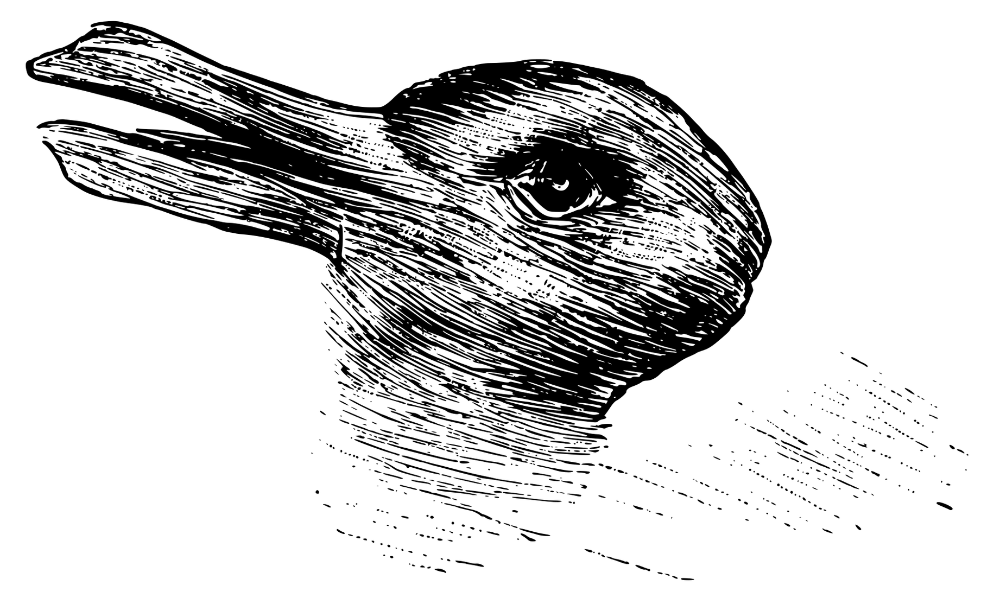

# What is "Meaning" and why is it so important to Sociology?

Look at this illustration.[^1] What do you see?

[^1]: This illusion is the famous "rabbit and duck" illustration, originally [from](https://en.wikipedia.org/wiki/Rabbit%E2%80%93duck_illusion) an 1884 German Newspaper, which is commonly used to demonstrate the "gestalt shift" in psychology by which the illustration's appearance suddenly shifts from "being" a rabbit to "being" a duck.

`some people see a rabbit, some see a duck.  Some see both at different moments.  But the point for us is that a series of mechanisms in your brain convert the lines on the page---more properly, the pixels digitally representing the lines made by someone's hand inspired by actual rabbits and ducks---into something that you recognize as an intergrated thing.  Sociologists (and anthropologists, philosophers, congnitive scientists, literary theorists, and on and on) summarize this process of recognition using the terms **meaning** or **significance**.`

`Micro: Weber's basic sociological terms`

`Macro: Durkheim's views about norms?`

`The essence of social construction is knowing the "aboutness" of a phenomenon`

`The composition of meaning into symbols, made of signifier and signfied.  In simple cases, what is signified is a concrete, material entity in the world.  In a great number of other cases, however, what is signified by a symbol is *not* concrete, as in the concepts of a "market" or "love."`

## Meaning as unifying

`it is difficult to overstate the imporance of culture and meaning to the conduct of your everyday life.  It is there that all information is stored that literally keeps you alive, and allows you to interact with society.`

## Meaning as a source of conflict and a vector for power

`But from very on in human history, culture has also been a way to (intentionally or not) establish boundaries and legitimate domination.`

`One "natural" source of conflict around culture is **polysemy**, or the fact that particular symbols can be interpreted in a variety of ways.`

# Cultural Universals

## Marriage

## Property Rights

## Religious Ritual

## Language

# A brief history of civilization with a specific focus on culture

# Dynamics today
