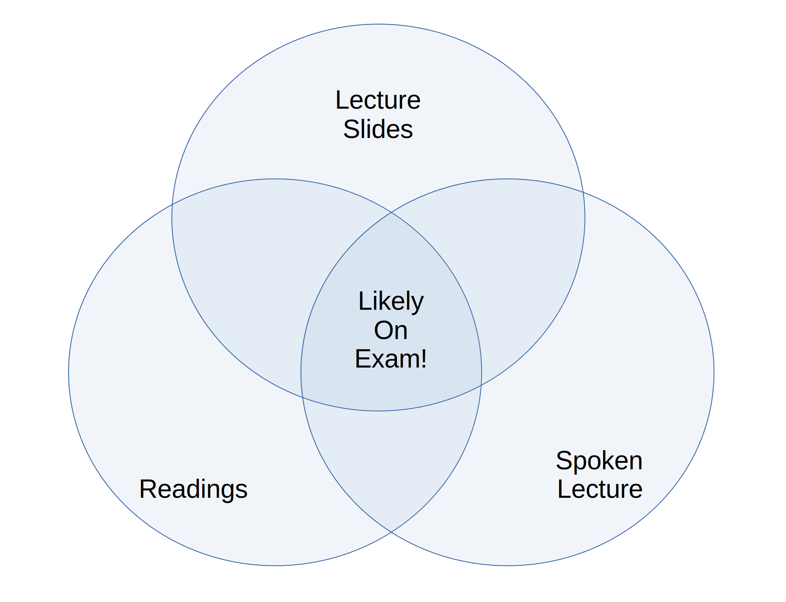

::: {style="text-align: center;"}
](images/0_header_3.jpg){fig-align="center" width="633"}
:::

# Welcome!

Welcome to the lecture notes for SOC 105 at Stony Brook University! My name is Nick Wilson, and I've been teaching this course here since the Fall of 2016. Until now, I employed a regular textbook, but this semester have decided to transition to these typed lecture notes.

::: column-margin
Formally, I am an Associate Professor of Sociology at Stony Brook University, but I don't particularly like such trappings, especially in person, so please just call me "Nick." Note, however, that many of your professors want to be addressed formally!
:::

## Why These Notes?

Over the course of teaching introduction to sociology (with enrollments of around 250 students), I've grown increasingly dissatisfied with the textbook I was using, and, indeed, any one that I could find. This was for several reasons.

1.  **Cost.** Most textbooks seem unjustifiably expensive today. A quick glance at Amazon shows that they can range from \$30 to over \$150 to buy, and still a substantial amount of money to rent.
2.  **Quality.** While most textbooks are nominally written by well-known academics, as we will see, sociology is a notoriously difficult subject to even introduce, so the quality of textbooks varies wildly, both within and among the different offerings.
3.  **Voice.** You will find that I prefer to write prose in a direct, conversational, active style, and this is something that is surprisingly hard to find in a textbook. Even ones that are written "simply" tend to overdo the passive voice, pointlessly elevate jargon, exaggerate the unity and certainty of sociology's findings, and employ other false trappings of scientific authority.[^1]
4.  **Datedness.** Because traditional textbooks take so long to conceive, write, vet, and physically produce, they are usually surprisingly dated by the time they are published.[^2]
5.  **Intellectual divergence.** Finally, I also noticed that I increasingly disagreed with most available textbooks. I especially chafed at them oversimplifying sociology. In my view, the field is ambiguous, difficult, and challenging; indeed, it is one of the hardest sciences to practice, because it has the most complex object of study---society itself. By extension, I have come to believe that an introduction to sociology should be clear, but not simple.

[^1]: I think I am most influenced by the writing styles of George Orwell [-@orwellPoliticsEnglishLanguage2013], Christopher Lasch [-@laschPlainStyleGuide2002], and Strunk and White's [-@strunkjrElementsStyleFourth2009].

[^2]: For instance, it is only now that textbooks are even acknowledging, much less considering the impact of, COVID-19.

With those reasons in mind, beginning in the summer of 2024 I decided to transform and extend my lecture slides into these notes, and I worked intensively to complete the first draft of these notes in the summer of 2026.

# Organization of These Notes

After this Introduction, the notes are divided into four main parts.

## Part I: Orientation

In Part I, I discuss sociology's distinctive intellectual style and heritage,[^3] its place among other disciplines,[^4] and then its (several) methods and their benefits and challenges of each.[^5]

[^3]: Chapter 1: [Imagination](/chapters/Ch_1_Imagination.qmd).

[^4]: Chapter 2: [Discipline](/chapters/Ch_2_Discipline.qmd).

[^5]: Chapter 3: [Methods](/chapters/Ch_3_Method.qmd).

## Part II: Conceptual Foundation

After that, since this a course meant to introduce you to the field, the bulk of the notes, comprising six chapters, is in Part II, which oulines what I consider to be the fundamental conceptual building blocks in sociology. I think sociology is fundamentally oriented around the intersection of meaning and action,[^6] especially in contexts of interaction,[^7] is usually organized following social structures,[^8] the result of which are qualities we have usually called identities or selves.[^9] Finally, there are two special characteristics of social structures that are such common features of sociological analysis that they have become foundational: that your place in social structures is not what it is only because of everyone's agreement, but also because of power and discipline;[^10] and that, especially in complex societies, almost every social structure exhibits some form of inequality.[^11]

[^6]: Chapter 4: [Meaning and Action](/chapters/Ch_4_Meaning.qmd).

[^7]: Chapter 5: [Interaction](/chapters/Ch_5_Interaction.qmd).

[^8]: Chapter 6: [Social Structure](/chapters/Ch_6_Structures.qmd).

[^9]: Chapter 7: [Identity](/chapters/Ch_7_Identity.qmd).

[^10]: Chapter 8: [Power and Discipline](/chapters/Ch_8_Discipline.qmd).

[^11]: Chapter 9: [Inequality](/chapters/Ch_9_Inequality.qmd).

## Part III: Elaborations

Part III combines these building blocks, along with the two world-historical shifts of central interest to sociologists (the emergence and eventual dominance of capitalism and the rise, transformation, and dissolution of large empires) to understand key features of the era in which we live, "modernity." The forces at work in this era are different from what came before in critical ways, and affect everything from our identities--our sense of race and ethnicity,[^12] gender and sexuality,[^13] and even how we imagine our place in the world[^14]--and has decisively reorganized our lives through political,[^15] economic,[^16] environmental,[^17] and even biological[^18] change.

[^12]: Chapter 10: [Race and Ethnicity](/chapters/Ch_10_Race.qmd).

[^13]: Chapter 11: [Gender and Sexuality](/chapters/Ch_11_Gender.qmd).

[^14]: Chapter 12: [Globalization](/chapters/Ch_12_Globalization.qmd).

[^15]: Chapter 13: [Politics](/chapters/Ch_13_Politics.qmd).

[^16]: Chapter 14: [Economics](/chapters/Ch_14_Economics.qmd).

[^17]: Chapter 15: [Environment](/chapters/Ch_15_Environment.qmd).

[^18]: Chapter 16: [Health](/chapters/Ch_16_Health.qmd).

# How To Read These Notes (And Do Well In This Course!)

This way of communicating course content in SOC 105 is new to me, and experimental, so I'm eager to hear your feedback as the semester progresses. With that said, I've written these notes with a few ideas in mind about how they integrate with other course materials (particularly the exams and lectures), so I have some advice about how to make the most out of these notes.

## Logical Flow

I've tried to keep each unit within these notes fairly tightly self-contained, which means you *should* be able to read each one without having to read all of the others. At the same time, I've also (especially at the beginning and end of each unit) tried to tie the units together into a logical sequence, so you will also (hopefully) understand a larger picture of *why* particular units come before and after one another, and why others are clustered together.

This duality implies that there are two levels on which you can understand any given unit: first, on its own terms[^19]; and second, in the context of the mosaic of sociology as represented by all the units together. Consequently, it is a good idea to ask yourself two kinds of question when reading a unit:

[^19]: For instance, what do you learn about Race or Gender just by reading those units?

> What are the three or four main conceptual and empirical points I need to know about the topic covered in the unit? How do empirical and conceptual details in the unit relate back too these "big" points?

and

> How does this unit fit into the course? How does it help me understand units that came before, and flow into those that follow it? How would my understanding of other units change if I didn't know the information in this one?

## Marginal Helpers

Depending on how you are reading this overview, you will see a more-or-less evident right hand column running alongside the main text. In it, post three main things:

::: column-margin
**Boldface type** is a more noticeable form of text used to emphasize important ideas or words.
:::

1.  **Asides**, both empirical or personal. (You'll just have to read them to find out which they are!) I don't consider these essential to grasping the main points of a chapter, but (I hope) they can add context for interested readers.
2.  **Definitions.** Throughout the text, when you encounter a **boldface** term in the main column, I have tried to state a plain definition nearby[^20] in the right-hand column. This is both for your convenience (to alert you to key terms), but also so you can see the term both in its content (used in the main column) and abstracted out of that context to its most general form (in the right-hand column).[^21]
3.  **Links and references.** Typically, the first time I discuss a data source, book or article in the text, you will see a reference to it in the right-hand column. Likewise, since sociology's empirical depth is virtually bottomless, I will sometimes also provide links and materials for further exploration by those who are interested.

[^20]: Where *exactly* the definitions are placed is partly a function of the underlying software used to render this text, and partly how you are viewing it.

[^21]: You'll notice that an important exception to this rule is when I use boldface type to announce the key element of a list, like this one---I haven't given you definitions for "asides" or, well, "definitions."

## How I test

I think that SOC 105---and particularly the way I organize and teach it---is unusual among introductory college courses. There is *very* little memorization necessary to do well. Instead, I ask that you try to *grasp* key concepts and understand how they relate to the world around us. Accordingly, I ask three classes of question on my exams (which, by the way, are all multiple choice and taken in class on a scantron sheet).

1.  **Conceptual questions.** I want to know whether you can reasonably tell the content of a concept in the course[^22] and tell whether it is different from other terms.[^23] So my exams generally contain a good number of questions that ask you to both identify a concept given a description (and vice versa) as well as to tell the difference among key concepts.
2.  **Application questions.** I also want to assess your ability to make connections between concepts and empirical material--you should be able to tell if an application of a concept is appropriate to some phenomenon, and what leverage it gives us in understanding it.[^24] Since I want to know how well you do this *beyond* simply memorizing what I've talked about in the course, questions I ask on exams in this category will only rarely be from applications and examples I discussed in lecture or these notes. Usually, they will be something new.
3.  **"Big" empirical questions.** I *hate* questions that require memorizing empirical details---this is no longer how any of us learn, process, or store information. When it comes to knowing and remembering facts about the world, I care far more that you're able to understand *why that fact is significant* relevant to a particular purpose, concept, theory, or phemonenon. Thus I *will* ask you factual questions that are highly relevant to concepts and phenomena in the different units, but I *will not* ask about nit-picky, subtle differences.[^25]

[^22]: Like "race," "inequality," "social order," "bureaucracy" and so on.

[^23]: I'd like to know whether you can differentiate among a "formal" and "informal" organization, for instance.

[^24]: For instance, "capitalism" would be a strange concept to use to think about an economic organization with no money or investment for profit, and some interactions are best seen through the lens of "gender," while others might be less so.

[^25]: For instance, relative to education, I might ask whether "very few," "about half," or "almost all" of the U.S. population has a Ph.D. degree. Knowing the answer makes a big difference in your understanding of the stakes of education in the U.S., but knowing whether the answer is 1.4% or 1.5% of the population does not.

Two further comments are warranted. The first is that I *really* want you to be successful in this course.[^26] Therefore, I will *never* ask you a "gotcha" or trick question on an exam. Almost always, the right answer is the obvious[^27] one---provided you have studied!---so you shouldn't agonize over the possibility that I'm playing mind games with you.

[^26]: This is both because I think sociology is awesome and want to arouse your curiosity in it, and also because I have no reason to try and "weed out" anyone.

[^27]: I am *not* saying "common-sense!" There are important times where a sociological understanding of a word that we use in everyday life diverges quite a bit. So if you don't study and try to just wing an exam, you'll be disappointed.

Second, you may have already noted that conceptual questions, application questions, and big empirical questions, even when they're narrowed-down in the way I describe above, cover a huge amount of logical ground. So how do you know *which* concepts, applications, and phenomena to focus on when you study? For a clue, notice that there are basically three sources of information available to you in this course: what you read before class, what I present on the slides in class, and what I say about those slides and the reading. As you can see from the below [diagram](#fig_exam), where these three sources of information overlap is where *I* would concentrate my focus!

{#fig_exam}